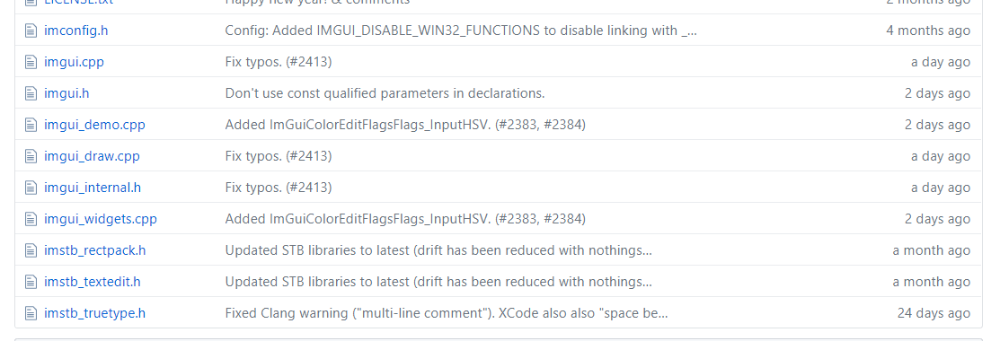
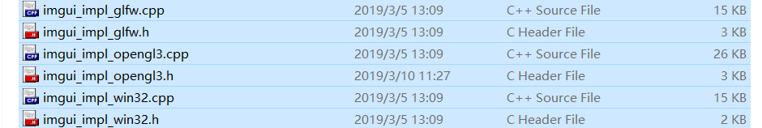
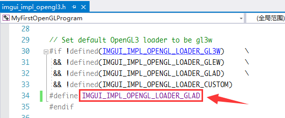

这个玩意资料有点少，所以记录一下怎么开始上路，怎么爬一些坑，供自己和别人参考……

<!-- more -->

## 怎么学这东西

这可能是最大的问题了。

首先肯定要看它的官网，[https://github.com/ocornut/imgui](https://github.com/ocornut/imgui)；

>  然后你会发现官网的这个RAEDME是个蛇皮没什么大用……

然后我们发现目录下有个doc目录，进去发现也没什么用，真的是……

有用的部分在example文件夹下， [比如这个示例！](https://github.com/ocornut/imgui/blob/master/examples/example_glfw_opengl3/main.cpp)这就是我们学习的最重要的资源了！！！


## 安装

* 首先`git clone`这个仓库

    ```bash
    git clone https://github.com/ocornut/imgui
    ```

* 然后把目录下的所有`.h`和`.cpp`文件都复制到自己的项目里

    

    就这些东西，全部复制进去就对了；

* 还没完，打开examples文件夹，进去可以看到有好多`imgui_impl_***.*`，挑选自己需要的那些都复制到自己的项目里；比如我的目录下

    

    错了可能是复制多了几项，来回删一删试试……还是比较迷的……

* 然后就可以跑了，跑一下发现报错**gl3w.h**没有，当然了用的不是这个库当然就没有了……打开imgui_impl_opengl3.h，把这里改成你所使用的库

    

    应该是都在这几个里边了，我使用的是glad，所以使用了glad的宏；


## 跑跑第一个程序

不出意外的话应该是可以跑了，我们可以直接把仓库的examples文件夹里，合适自己的用的那个复制过来试试，比如我用的是glfw+openGL3，我复制了[这里的代码](https://github.com/ocornut/imgui/blob/master/examples/example_glfw_opengl3/main.cpp)（路径是`/examples/example_glfw_opengl3/main.cpp`），这就可以点点画画了。

