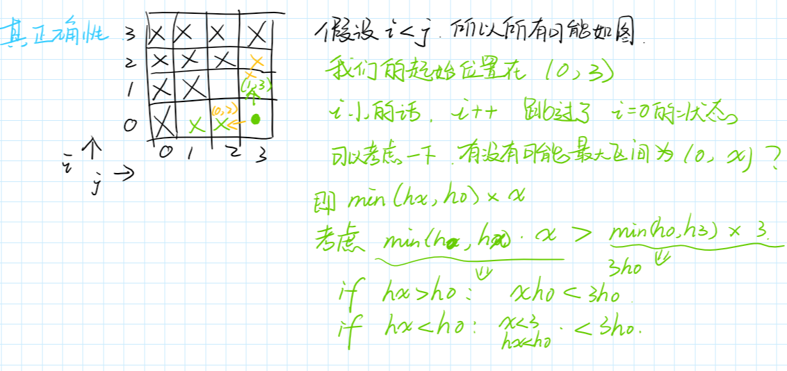

## 题目

链接给到 [https://leetcode-cn.com/problems/container-with-most-water/](https://leetcode-cn.com/problems/container-with-most-water/)

给定 n 个非负整数$a_1, a_2, ... ,a_n$，每个数代表坐标中的一个点$(i, a_i)$ 。在坐标内画 n 条垂直线，垂直线 $i$ 的两个端点分别为 $(i, ai)$ 和 $(i, 0)$。找出其中的两条线，使得它们与 x 轴共同构成的容器可以容纳最多的水。

说明：你不能倾斜容器，且 n 的值至少为 2。


图中垂直线代表输入数组 [1,8,6,2,5,4,8,3,7]。在此情况下，容器能够容纳水（表示为蓝色部分）的最大值为 49。

示例:

```
输入: [1,8,6,2,5,4,8,3,7]
输出: 49
```


## 分析

正确的方法是，开始时将两个线放在两边，然后每次都将较短的那根线向内移动，同时更新最大面积；

官方说明是这样的：[https://leetcode-cn.com/problems/container-with-most-water/solution/sheng-zui-duo-shui-de-rong-qi-by-leetcode/][https://leetcode-cn.com/problems/container-with-most-water/solution/sheng-zui-duo-shui-de-rong-qi-by-leetcode/]

### 证明

我们可以简单的证明这个解法的正确性：



简单说明一下，$i, j$ 即左右两个端点。

最后我们可以确定，原来的面积为$3h_0$：

* 如果$h_x > h_0$，那么面积为 $xh_0$，明显是小于 $3h_0$的；
* 而如果 $h_x<h_0$ 的话，一方面$x<3$，另一方面 $h_x<h_0$，所以肯定也是小于 $3h_0$的；

我只证明了，当 $i$ 按照我们的方式移动时，不会错过任何的情况；

很明显，$j$ 也是一样的道理，所以我们的解法是不会错过最优解的。


## 题解

```python
class Solution:
    def maxArea(self, height: List[int]) -> int:
        themax = 0
        i1, i2 = 0, len(height) - 1
        while i1 < i2:
            area = (i2 - i1) * min(height[i2], height[i1]) 
            if area > themax:
                themax = area
            if height[i1] < height[i2]:
                i1 += 1
            else:
                i2 -= 1
        return themax
```