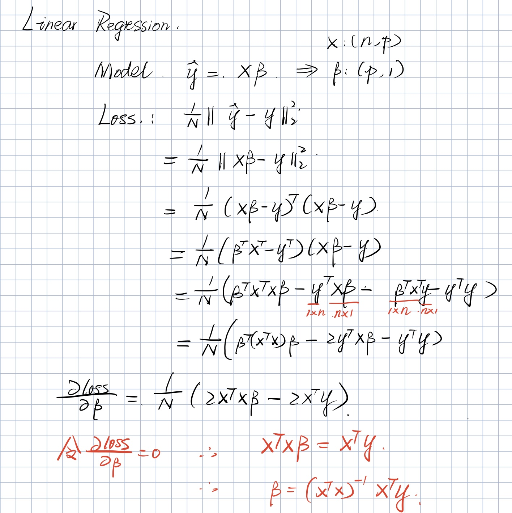

# Linear Regression

Assume the model is:
$$
\hat{y} = f(x) = X\beta
$$
We can write a base class using this formula for our linear regression implement below,

```python
class LinearRegressionBase:
    def __init__(self):
        # beta: shape (p, 1)
        self.beta = None

    def fit(self, X, y):
        # X: shape (n, p), Y: shape (n, 1)
        pass

    def predict(self, X):
        # X: shape (n, p)
        return X @ self.beta
```

And we can generate some data for test,

```python
n = 100
p = 5
noise = np.random.randn(n) / 10
X = np.random.randn(n, p) * 10
weights = np.ones(p)
weights[[1,2,3]]=[2,5,3]
y = (X @ weights + noise).reshape(-1, 1)
X.shape, y.shape, X.mean(), y.mean()
```

The code above represents the ground truth is
$$
y = 1\cdot[x]_0 + 2\cdot[x]_1 + 5\cdot[x]_2 + 3\cdot[x]_3 + 1\cdot[x]_4
$$


## Ordinary Explicit Solution

Using **Mean Square Error** as the loss function
$$
\begin{align*}
loss &= \frac{1}{N} ||\hat{y} - y||_2^2 \\
     &= \frac{1}{N} ||X\beta - y||_2^2
\end{align*}
$$
Find the derivative of $\beta$. 



The least square solution would be like
$$
\hat\beta = (X^T X)^{-1} X^T y \\
(\text{assume }(X^T X)\text{ invertible})
$$

Using python to implement that,

```python
class LinearRegression:
    def fit(self, X, y):
        super().fit(X, y)
        self.beta = (np.linalg.inv(X.T @ X) @ X.T) @ y
```

And test it,

```python
lr = LinearRegressionO()
lr.fit(X, y)
pred = lr.predict(X)
print(f'beta {lr.beta.flatten()}')
print(f'error {np.linalg.norm(pred-y)}')

# beta [0.99903924 1.99955203 5.00101573 3.00037858 1.00036293]
# error 0.9101951355773127
```


## Ridge Regression

Same as last part. But we add a l2 regularization to the loss function.
$$
loss = \frac{1}{N}||X\beta-y||^2_2+\lambda||\beta||_2^2
$$
Very similar to the last part, take the derivative of $\beta$, we get
$$
\frac{\partial loss}{\partial\beta}=\frac{1}{N}(2X^TX\beta-2X^Ty)+2\lambda\beta
$$
Let the derivative to be 0. We get,
$$
\hat\beta=(X^TX+\lambda I)X^Ty
$$
We don't need to assume the invertibility since the $(X^TX+\lambda I)$ is always invertible. 

> Simple proof: 
>
> Any vector is the eigenvector of $\lambda I$ since $\lambda I v = \lambda v$. And all eigenvalues of $\lambda I$ is $\lambda$.
>
> $X^TX$ is a symmetric matrix and it's positive semi-definite, so all the eigenvalues are bigger or equal to 0. 
>
> So any eigenvalues and eigenvectors of $X^TX$, note by $a_i, v_i$,
>
> $$
> (X^TX+\lambda I) v_i= (X^TXv_i+\lambda Iv_i)=a_iv_i+\lambda v_i=(a_i+\lambda)v_i
> $$
>
> So all the eigenvalues of $(X^TX+\lambda I)$ is bigger or equal to $\lambda>0$. 
>
> Which means  $(X^TX+\lambda I)$ is always invertible. 


Using python to implement that,

```python
class RidgeRegression(LinearRegressionBase):
    def fit(self, X, y, l):
        # l is the \lambda in the formula
        super().fit(X, y)
        self.beta = (np.linalg.inv(X.T @ X + l * np.identity(X.shape[1])) @ X.T) @ y
```

And test it, using different $\lambda$,

```python
l = 10:
beta  [0.99547771 1.99660303 4.99462785 2.99652915 0.99752248]
error 1.1770827499055974

l = 1
beta  [0.99868234 1.99925674 5.00037611 2.99999319 1.00007827]
error 0.9132585574988228

l = 0.1
beta  [0.99900354 1.9995225  5.00095176 3.00034004 1.00033446]
error 0.9102258292688261
```


## Lasso

