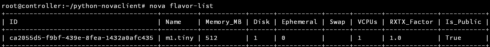
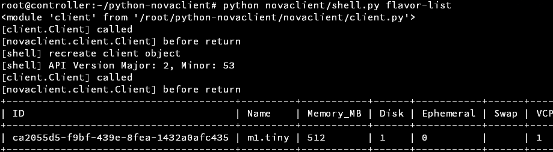

最终目标： 为Nova开发一个小组件！

记录自己摸索的过程啦，持续更新直到完成


<!-- more -->


先看看书，再看看github上Openstack的组织仓库，找到了两个仓库

- **Nova**：<https://github.com/openstack/nova>，Nova的大仓库，主要的功能实现应该都在这里了
- **Nova client**：<https://github.com/openstack/python-novaclient>，命令行 cli （应该主要是Nova命令）的客户端

感觉应该是最重要的需要看的仓库了，可以看到调用命令行的过程，然后继续看看，还有一些可能会有用的仓库

- **Openstack client**：<https://github.com/openstack/python-openstackclient>，命令行（Openstack命令）的客户端
- **Horizon**：<https://github.com/openstack/horizon>，Horizon的实现里，想必也有不少的基于 Http 请求的Nova API的调用实例


之前已经看过了Nova的代码了，感觉没有太多的涉及API的部分，直接去看Nova Client部分吧

下载Nova client的代码，发现了 `doc`文件夹，打开以后发现和网站提供的文档是一致的， 就直接在网站上看了

<https://docs.openstack.org/python-novaclient/latest/reference/api/index.html>


网站上来就是代码了

```python
>>> from novaclient import client
>>> nova = client.Client(VERSION, USERNAME, PASSWORD, PROJECT_ID, AUTH_URL)
```

> 幸好有之前跟着官网一步一步配置的经验，不然看着这参数肯定一脸懵。
>
> 想起来之前官网的配置教程给了一个 `admin-openrc` 的文件使用，每次调用 cli API 之前都要使用 `. admin-openrc` 激活一下。

找到自己的虚拟机，打开`admin-openrc`看一下，发现给了不少的参数

```
export OS_PROJECT_DOMAIN_NAME=Default
export OS_USER_DOMAIN_NAME=Default
export OS_PROJECT_NAME=admin
export OS_USERNAME=admin
export OS_PASSWORD=****
export OS_AUTH_URL=http://controller:5000/v3
export OS_IDENTITY_API_VERSION=3
export OS_IMAGE_API_VERSION=2
```

激活环境变量，测试一下使用`nova flavor-list`，正常输出。



把这些放到文档给的代码里试验一下，发现是不可以的，报错了，明显是我的权限验证有问题。

从源代码开始分析一下，全文搜索`OS_PROJECT_`，5个文件中存在，除了`doc`和`test`中以外，就只剩下`shell.py`这个文件了，果然，这个文件从环境中读取了`OS_PROJECT_...`的变量。同时发现这个文件存在main函数，一定也是全程序的执行入口。从这个文件一路按图索骥，找到了熟悉的`client.Client()`调用，然后惊喜的发现，居然有两个`client`？？？还好注释写的明白，第一个声明只是为了确定version，第二个声明才是真正的声明。

> 遇到了一个函数 importutils.import_class(...)，从根目录水平导入一个类，作为一个变量来使用，python真是博大精深啊……
>
> 源码：
>
> ```python
> return version, importutils.import_class(
> ​        "novaclient.v%s.client.Client" % version.ver_major)
> ```
>
> **[Update]：**
>
> 误会了，原来这是 Openstack 自己完成的一个函数，源码大致是这样操作的：
>
> `getattr(sys.modules[mod_str], class_str)`
>
> 试验了一下，和`import`语句导入的模块无差，算是一种动态导入的方式了

发现目录下只存在v2的子目录，因此看来是不存在使用 verison=2.x 这种操作了


现在思考一下，还有一个问题悬而未决，是这个程序是如何监听的，思考了一番也没有找到，只有一行代码感觉是相关的

```python
args.func(self.cs, args)
```

应该是自己给`args`加的属性，具体加了什么函数，还是不是很明确，应该是在这里执行的命令。

猜测`nova`命令就是使用了`shell.py`的命令解析，所以试着直接运行 `shell.py`并加命令行参数，果然是可以的。

然后再`shell.py`里简单的加了输出，没有问题；再然后在`Client`函数里加Log，发现没有输出，找了半天原因，发现是导入模块时，直接导入了已安装的包的模块，而不是当前目录下的模块，强行改造源代码，加入了输出的部分，一切正常了。




现在回头，从之前我们写的`flavor-list`这个命令开始进入程序分析

我们全项目匹配`flavor list`类似的关键字，找到了一个函数，`do_flavor_list`，位于`novaclient->v2->shell.py`，尝试着加一下log，输出了，没有问题，我们跟着这个函数的调用继续研究。

```python
def do_flavor_list(cs, args):
    """Print a list of available 'flavors' (sizes of servers)."""
    if args.all:
        flavors = cs.flavors.list(...)
    else:
        flavors = cs.flavors.list(...)
    _print_flavor_list(cs, flavors, args.extra_specs)
```

可以看到，关键函数是 `cs.flavor.list()`，我们去找一下`flavor`的定义（在`v2->client.py`)

```python
self.flavors = flavors.FlavorManager(self)
```

继续去看`FlavorManager`，这里可以直接右键跳转了，发现`FlavorManager`的`list()`方法是处理了一些参数，然后转发给了`_list`这个方法。这个类里没有`_list`方法了，继续去基类找，一路找到`base.py`的`Manager`类，这个类有`_list`方法，获得重要参数的方法是：

```
if body:
    resp, body = self.api.client.post(url, body=body)
else:
    resp, body = self.api.client.get(url)
```

看一下`api`的定义，发现要一路回到`self.flavors = flavors.FlavorManager(self)`，这个`api`就是`client`本身，找到`client`实例的`client`属性，发现是个`httpclient`对象，用`_construct_http_client`方法构造，具体的操作流程就是发送了一个请求给`/flavors`，然后获得返回值，一路返回，也就是这个`api`的操作流程了。


基本上大部分的API都可以通过这样的流程找到对应的位置，在此也就不再赘述啦……

下面该去看`Nova`的源码了，看一下这个服务端到底是如何建立起来的