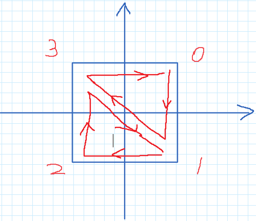

学习OpenGL还是挺难理解的，入门路上遇到了一些问题，在这里埋埋坑，希望可以帮助一些后来者

主要的学习来源是[learnopengl的中文教程官网](https://learnopengl-cn.github.io/01%20Getting%20started/04%20Hello%20Triangle/)；

基本不会写到具体的过程，具体的过程在教程官网上已经非常详细了，所以这里基本上会写成类似于Q&A，或者记录一些不理解的地方的形式……

<!-- more -->

## 链接顶点属性


## EBO/IBO，索引

这里讲的不错，https://blog.csdn.net/fenghen777/article/details/46981781

我们还是按照官网的教程来讲，官网给了这样一个例子，要画一个4边形；

```cpp
float vertices[] = {
    // 第一个三角形
    0.5f, 0.5f, 0.0f,   // 右上角
    0.5f, -0.5f, 0.0f,  // 右下角
    -0.5f, 0.5f, 0.0f,  // 左上角
    // 第二个三角形
    0.5f, -0.5f, 0.0f,  // 右下角
    -0.5f, -0.5f, 0.0f, // 左下角
    -0.5f, 0.5f, 0.0f   // 左上角
};
```

为什么是6个点呢，因为OpenGL是按照三角形来渲染的，所以一个四边形就要分为两个三角形来绘制。

**这样就造成了一个问题**，有两个点是重复的，我们当然不想重复，不优雅啊！（当然最重要的问题是会造成多余的存储开销，多存了50%的点，如果三角形更多的话，这个开销还是很可观的）。

所以我们考虑一个新的方式，就是只输入4个顶点，然后我们指定绘制的顺序，就是这样：

```cpp
float vertices[] = {
    0.5f, 0.5f, 0.0f,   // 右上角
    0.5f, -0.5f, 0.0f,  // 右下角
    -0.5f, -0.5f, 0.0f, // 左下角
    -0.5f, 0.5f, 0.0f   // 左上角
};

unsigned int indices[] = { // 注意索引从0开始! 
    0, 1, 3, // 第一个三角形
    1, 2, 3  // 第二个三角形
};
```

不知道你们怎么样，我第一次看是有点懵，仔细看了一下大概是这样的：



明白了吧，这个顶点的顺序就是顶点数组里的顺序。

