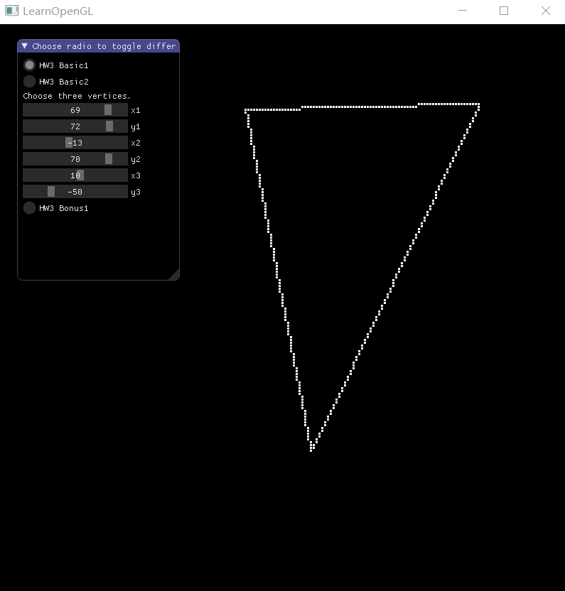
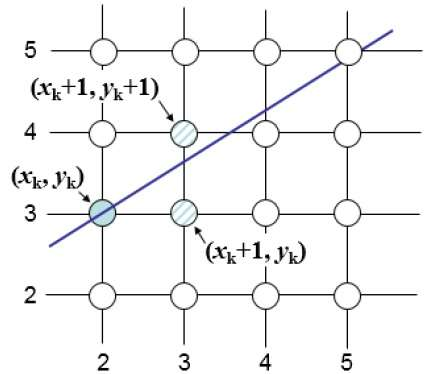
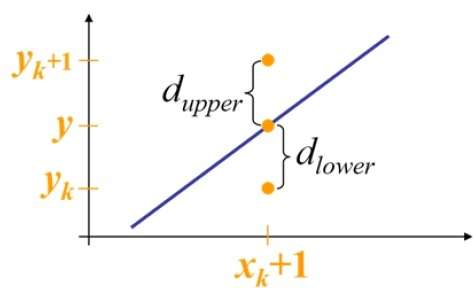
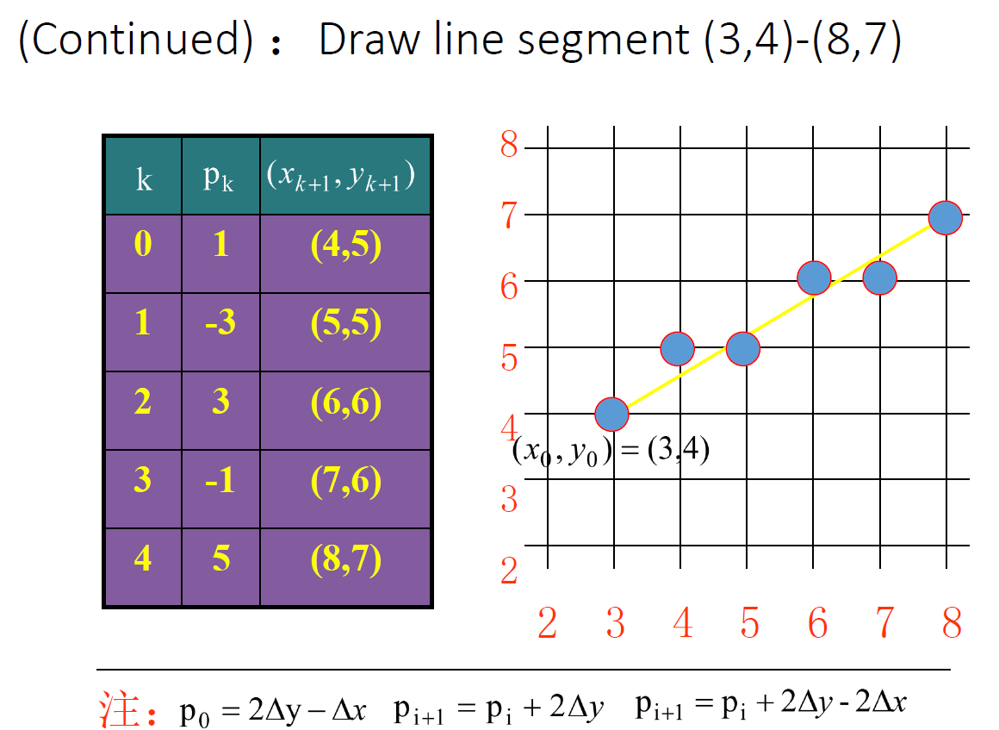
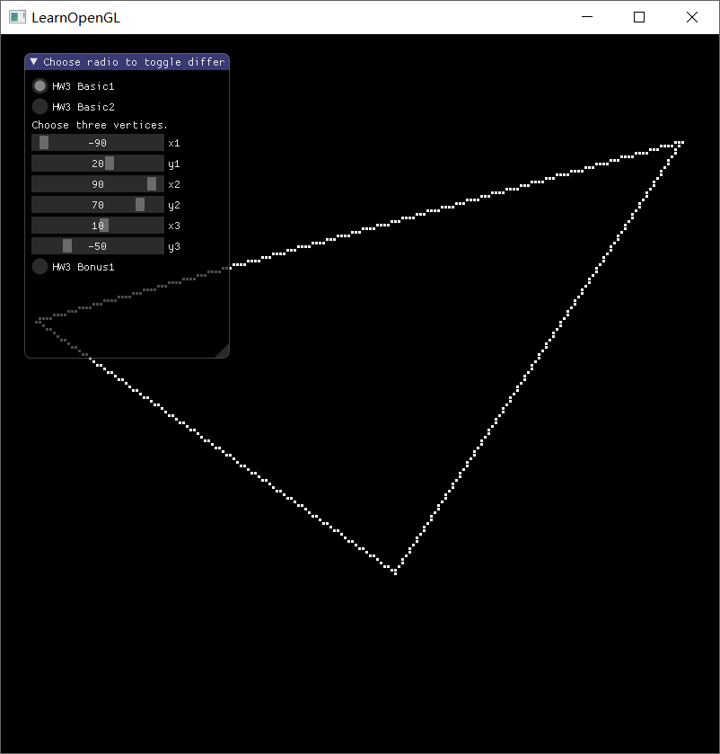
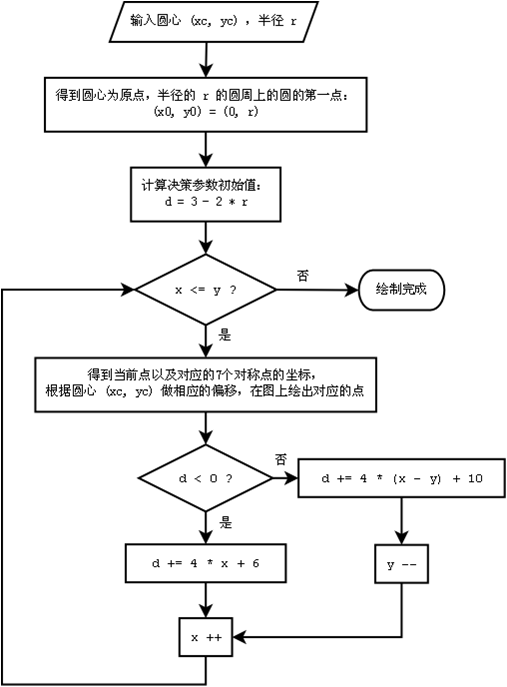
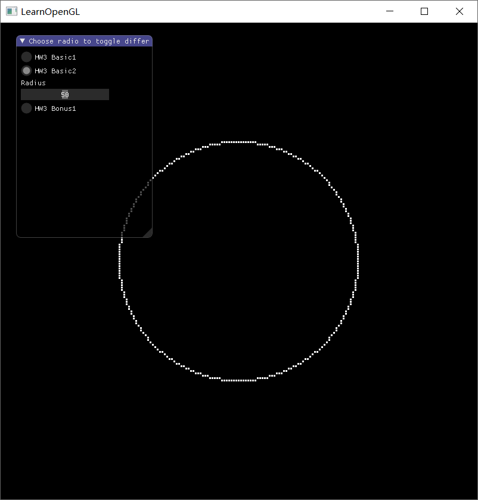
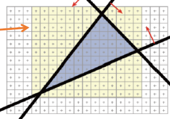
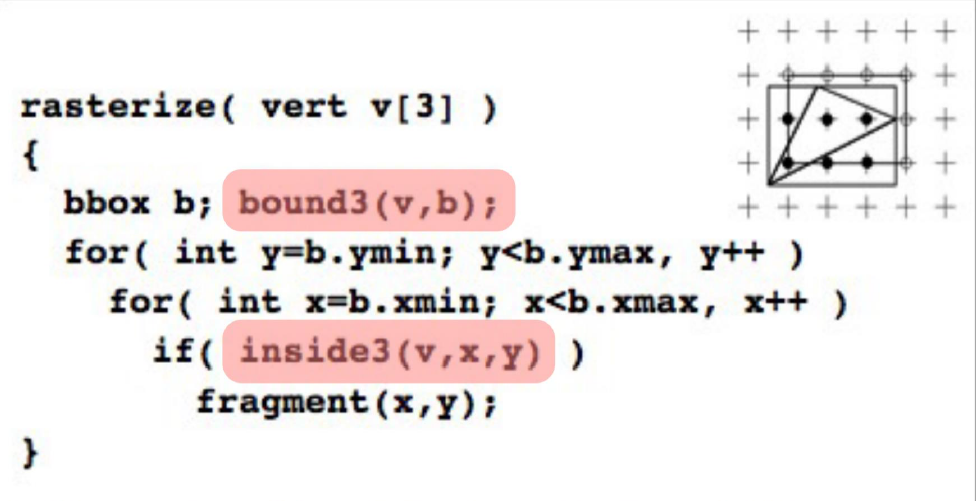
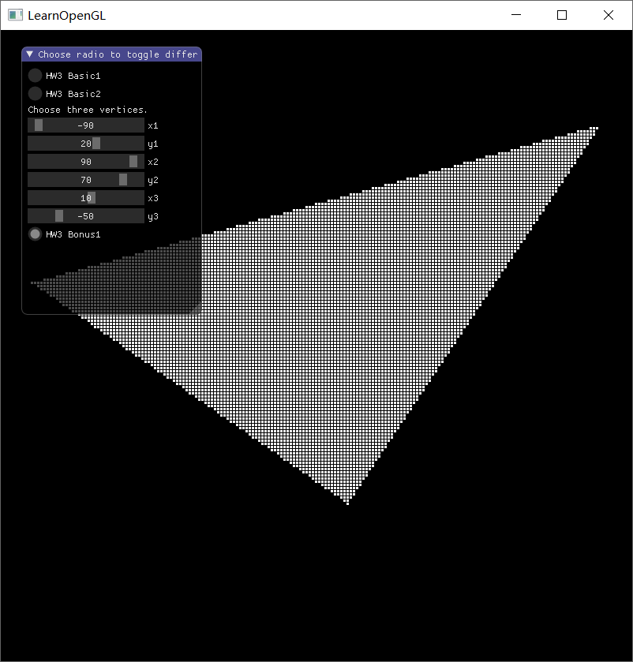

光栅化算法，主要是：

* **DDA** 画直线算法；
* **Bresenham** 快速画直线算法；
* **Bresenham** 画圆算法；
* **Edge Equation** 三角形填充算法；


<!-- more -->


## 实现结果

先看效果啦，分别是使用**Bresenham**算法画直线、圆、并使用**Edge Equation**算法填充三角形的效果




## DDA

想了想还是先提一句DDA吧，这个也是经典了

DDA就是简单的数值微分然后拟合的算法，它的原型大致过程如下：

1. 给两个点 $(x_1, y_1)，(x_2, y_2)$
2. 可以得到一个直线的表达式 $y=mx+b$
3. 每次推进一个$x$，即每次 $x=x+1$，然后计算 $y=mx+b$ 的值，每次要进行取整；

如果 $m>1$，那么可以选择每次将 $y$ 推进1格。


通常来说，DDA对上述过程做了一定的优化，每次不需要都计算 $y=mx+b$ 了，而是选择如下的公式计算：
$$
x_{k+1}=x_k+1；\\
y_{k+1}=y_k+m；
$$
到了 $m>1$ 时就换成 $x_{k+1}=x_k+\frac{1}{m}$ 就好了，计算出结果以后取整作为像素点的坐标值。

看起来好了很多，但是还是要涉及到浮点数的运算，还有不少的取整操作，对于计算机来说实在是有点困难（因为会算的很多，浮点总是要慢一些的，还会涉及到一定的舍入误差累计）。


## Bresenham算法

感谢Bresenham老爷子提出的这个Bresenham算法，现在这基本上是所有直线算法的标准了，一般都会直接集成到硬件里。


### Bresenham 直线算法原理

先上一张图




可以看出来，每次选下一个点都是在 $(x_k+1, y_k+1)$ 和 $(x_k + 1, y_k)$ 之间选取，到底选哪个要看直线到底在这个x坐标下，离哪个更近一些。





我们把上下的距离分别标注为 $ d_{upper} $ 和 $d_{lower}$ ，当下边比较大的时候，就要选取上边的点，所以我们让他们相减，代入直线公式可以得到
$$
d_{lower} - d_{upper} = 2m(x_i + 1) - 2\overline{y_i} + 2B - 1
$$
我们已经知道了 $\Delta x = x_{end} - x_{start} $ 是一个正值，所以我们可以把这个乘到上式，不会影响正负。
$$
p_i = 2\Delta y \cdot x_i - 2\Delta x\cdot \overline{y_i} + c
$$

> 这里 $\Delta x= x_{end} - x_{start}， \Delta y = y_{end} - y_{start}，m=\Delta y/ \Delta x$
>
> ​		$c=(2B-1)\Delta x + 2 \Delta y$；

然后我们可以代入算出来
$$
\begin{align}
\mathrm { p } _ { 0 } &= 2 \Delta \mathrm { y } \bullet x _ { 0 } - 2 \mathrm { x } \bullet \overline { y } _ { 0 } + ( 2 B - 1 ) \Delta x + 2 \Delta y \\
&= 2 \Delta y \bullet x _ { 0 } - 2 \left( \Delta y \bullet x _ { 0 } + B \bullet \Delta x \right) + ( 2 B - 1 ) \Delta x + 2 \Delta y \\
&= 2 \Delta y - \Delta x
\end{align}
$$
第二步代入了直线方程

> * 要注意这个公式只有 $p_0​$ 可以这样推导出来，因为 $\overline {y_0} = mx_0 + B​$，而其他的 $y_i​$ 就不能这么简单的算出来了。
>
> *  $\overline{y_i}$ 就是在 $i$ 这个点处，光栅化以后的纵坐标的值

还可以进一步的化简
$$
\begin{aligned} p_{i+1} - p_{i} & = \left( 2 \Delta y \bullet x _ { i + 1 } - 2 \Delta x \cdot \overline { y } _ { i + 1 } + c \right) - \left( 2 \Delta y \bullet x _ { i } - 2 \Delta x \bullet \overline { y } _ { i } + c \right) \\ & = 2 \Delta y - 2 \Delta x \left( \overline { y } _ { i + 1 } - \overline { y } _ { i } \right) \end{aligned}
$$

* 这里如果 $p_i \leq 0$，那么 $\overline {y_{i+1}} - \overline{y_i} = 0$，那么 $p_{i+1} = p_{i} + 2 \Delta y$；

* 这里如果 $p_i  > 0$，那么 $\overline {y_{i+1}} - \overline{y_i} = 1$，那么 $p_{i+1} = p_{i} + 2 \Delta y - 2 \Delta x$；


简直是神器啊，得到这个以后就可以开始计算了，全是整数，不浮点不取整不舍入，还是拟合效果最棒的，贴一张图看个例子：





### Bresenham 直线算法实现

-----

这里使用了几个标志量：`flipY`和`flipXY`，表示我们我们对输入数据做的不同的预处理，目的都是把输入的直线转换为一个简单的形式，可以直接应用`x=x+1, y=...`这样的规则。

其中：

- 首先判断起始点的`x`坐标要在终点的`x`坐标前，如果不符合，则交换两个点的坐标；

- `flipY`：应用的情况如下图

  

  目的是将左上到右下的直线转换为左下到右上，就可以使用我们讨论的方法了；

- `flipXY`：应用的情况如下图：

  

  此时将纵坐标跨度较长的直线转换为了横坐标跨度较长的直线，也就可以应用我们讨论的办法了；

流程结束后，将得到的直线坐标根据这两个**flag**进行变换，得到真正的坐标。


### 代码

-----

```cpp
// 生成线
vector<float> genLinePoints(Point from, Point to) {
	Points points;
	bool flipY = false, flipXY = false;

	int dx = abs(to.x - from.x);
	int dy = abs(to.y - from.y);

	if (from.x > to.x) {
		swap2(from, to);
	}
	if (from.y > to.y) {
		flipY = true;
		from.y = -from.y;
		to.y = -to.y;
	}
	if (dy > dx) {
		flipXY = true;
		swap2(from.x, from.y);
		swap2(to.x, to.y);
	}

	dx = to.x - from.x;
	dy = to.y - from.y;

	printf("%d, %d\n", dx, dy);

	// 意味着要使用 x 作为 +1 更新的坐标
	vector<int> p(dx, 2 * dy - dx);
	points.push_back(from);
	for (int i = 1; i < dx; i++) {
		if (p[i - 1] <= 0) {
			p[i] = p[i - 1] + 2 * dy;
		} else {
			p[i] = p[i - 1] + 2 * dy - 2 * dx;
		}
		if (p[i] > 0) {
			points.push_back(Point(from.x + i, points[i - 1].y + 1));
		} else {
			points.push_back(Point(from.x + i, points[i - 1].y));
		}
	}
	points.push_back(to);

	if (flipXY) {
		for (int i = 0; i < points.size(); i++) {
			swap2(points[i].x, points[i].y);
		}
	}
	if (flipY) {
		for (int i = 0; i < points.size(); i++) {
			points[i].y = -points[i].y;
		}
	}
	return pointsToFloat3(points);
}
```

## Bresenham 算法绘制三角形

就是使用 **Bresenham** 算法画三条线，结果如下：



## Bresenham 算法画圆

### 算法原理概述

画圆和画直线的思路差不多，具体可以看<https://en.wikipedia.org/wiki/Midpoint_circle_algorithm>


同时要注意只需要画1/8圆就可以了，其他的部分可以对称过去。

起始的 $d = 3 - (2 * r)$，每次 $x = x + 1$，计算 $d$ 而得到 $y$ 坐标的值。

算法流程如下：


### 代码实现

```cpp
// 生成圆
vector<float> genCirclePositions(Point centre, int radius) {
	vector<Point> pv;
	int x = 0, y = radius, d = 3 - (2 * radius);
	auto eightPoints = circle8(centre, x, y);
	pv.insert(pv.end(), eightPoints.begin(), eightPoints.end());
	
	while (x < y) {
		if (d < 0) {
			d = d + 4 * x + 6;
		} else {
			d = d + 4 * (x - y) + 10;
			y--;
		}
		x++;
		auto eightPoints = circle8(centre, x, y);
		pv.insert(pv.end(), eightPoints.begin(), eightPoints.end());
	}

	auto data = pointsToFloat3(pv);
	return data;
}
```

### 实验结果



## Edge Equation 三角形填充算法

### Edge Equation 算法原理概述

三角形的填充使用**Edge Equation**算法，具体实现流程如下：

1. 计算得到一个矩形框，如下图黄色部分，将三角形全部包括进去；

   

2. 对矩形框内每个点进行计算，判断其是否在三角形的内部，如果在内部则进行渲染，否则不进行渲染；

   这一步使用的是简单的直线方程进行计算，首先我们可以得到两点的直线方程为：
   $$
   (y_1 - y_2)x+(x_2 - x_1)y+x_1 y_2 - x_2 y_1 = 0
   $$
   对每个点应用该公式，判断其正负性，则可以判断是否在三角形内部；

   > 具体使用时可能难以判断其正负性那个是在内部，可以使用第三个点辅助判断，与第三个点带入方程的符号相一致的是在三角内部的点，否则是在三角外部的点；


伪代码如下：




### Edge Equation算法实现


```cpp
std::function<bool(int x, int y)> genLineEquation(Point p1, Point p2, Point p3) {
	return [=](int x, int y) -> bool {
		auto lf = [&](int x, int y) {
			return (p1.y - p2.y) * x + (p2.x - p1.x) * y + (p1.x * p2.y - p2.x * p1.y);
		};
		if (lf(p3.x, p3.y) >= 0) {
			return lf(x, y) >= 0;
		} else {
			return lf(x, y) <= 0;
		}
	};
};

// 生成三角形，通过Edge Eqution算法
vector<float> genFilledTriPoints(Point p1, Point p2, Point p3) {
	vector<Point> points;
	int maxx = max(p1.x, p2.x, p3.x),
		maxy = max(p1.y, p2.y, p3.y),
		minx = min(p1.x, p2.x, p3.x),
		miny = min(p1.y, p2.y, p3.y);

	auto l1f = genLineEquation(p2, p1, p3);
	auto l2f = genLineEquation(p3, p2, p1);
	auto l3f = genLineEquation(p3, p1, p2);

	for (int i = minx; i < maxx; i++) {
		for (int j = miny; j < maxy; j++) {
			bool inside = l1f(i, j) && l2f(i, j) && l3f(i, j);
			if (inside) {
				points.push_back(Point(i, j));
			}
		}
	}
	return pointsToFloat3(points);
}
```

### 实验结果

