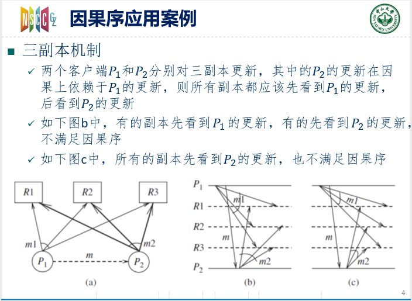
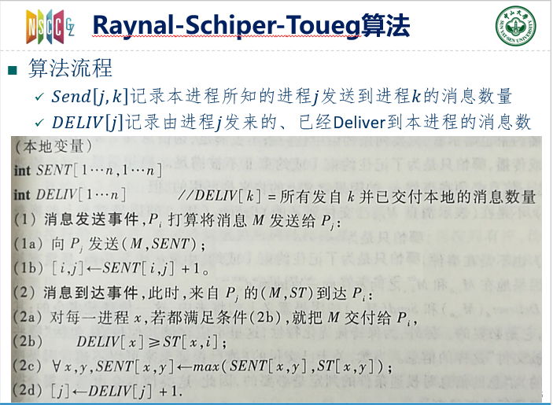

又是一篇没人写的算法，这门课没得参考就很尴尬

是一种分布式环境下的因果序保证算法

Pre: 消息通道，因果序

<!-- more -->

## 因果序是什么

一个消息通道保证因果序，意味着当两个消息的发送有依赖关系时，接收也要有依赖的关系，即：逻辑先发的一定会在逻辑上先收到。

数学一点，是这样的：

对任意两个发向同一进程的消息 $m_{ij}$ 和 $m_{kj}$  ，假设 $Send(m_{ij})\rightarrow Send(m_{kj})$ ，则 $Recv(m_{ij})\rightarrow Recv(m_{kj})$ ;

也就是说，发送是有逻辑依赖的关系，在接收时也是按照逻辑依赖的顺序接收的。

除了因果序，消息通道还有以下的顺序

* FIFO模型：信道运行为一个先进先出的队列模型

* 非FIFO模型：信道为一个集合，发送者向里面添加消息，接受者在里面移除消息，添加和移除是无序的

## 因果序应用：三副本机制

不再罗嗦了，课件非常清晰

## 保证因果序的基本思路

基本思路很简单

* 每条消息M都携带一条日志，保存了所有因果关系上在M之前的消息；
* M到达目的地是，先缓存自己，然后检查自己日志里的消息是否都到达了这个目的地（只检查目的地也是这里的就可以了）；
* 如果满足这个要求，那么就可以把自己交付给这个目的进程了；否则要进入等待的状态；

这里有一点小问题，如果记录因果上先于M的消息呢？

很简单，如果`m2`依赖于`m1`，`m3`依赖于`m2`。那么`m2`携带的日志里有`m1`；而`m3`只需要复制`m2`的日志，再加入`m2`就可以了。

也就是说，将所有已发送的消息沿着因果路径不断转发就可以了。

## Raynal-Schiper-Toueg算法

 注意：这个算法要求FIFO通道 

### 算法思想

基本思路是对我们上面所说的进行了简化，上面的描述中，记录了所有的消息，带来了很大的冗余。

我们考虑在**FIFO**通道下。当`m2`收到时，`m1`一定也已经收到了。进一步思考，发送者要求这条消息依赖于之前的，`i->j`的10条消息，如果`j`进程发现自己当前已经收到了来自`i`的20条消息，那么可以肯定，要求的那10条消息肯定包含在我们已收到的20条消息里（**FIFO**的特性，`i->j`通道上不会出现乱序）。

也就是说，我们只需要记录我们依赖的通道上的消息数量就可以了，这样就简化了传递的消息复杂度。

### 算法详述

算法详细描述如下：

* `Send[j,k]`记录本进程所知的进程`j`发送到进程`k`的消息数量

* `DELIV[j]`记录由进程`j`发来的、已经**Deliver**到本进程的消息数

**发送消息时：**

`i->j`发送消息，表明所有依赖的消息是自己当前的`SENT`矩阵，附带在消息里发送，然后`SENT[i, j]++`；

**接受消息时：**

`j->i`发送消息，接收到`j`的`ST`矩阵，就是当前消息的依赖，我们判断我们收到的消息数量（x是每个进程编号）
$$
DELIV[x] \geq ST[x, i]
$$
满足时，确认已收到了所有依赖的消息

然后对`SENT`按位取`max`，自身和当前消息的依赖都要满足；

然后`DELIV[j]++`，这是接收到的来自`j`的消息数量；

