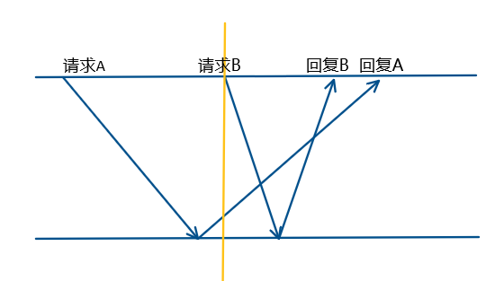

本文记录了三个分布式互斥算法，主要解决的是分布式系统中对临界区的访问控制

* **Lamport 算法**
* **Ricart-Agrawala 算法**
* **Singhal 算法**

<!--more-->

# 分布式互斥算法的基本

## 概念

要通过消息传递，来控制哪个进程可以访问临界区资源

## 性质

* 安全性：不会造成多个进程同时在临界区执行
* 活性：不会死锁，不会饿死
* 公平性：排序基本达到FIFO，先到先进

# Lamport 算法

> 最简单的算法，老爷子先占了个名字哈哈哈，老师上课吐槽这老爷子早期疯狂抢山头，用这么简单的算法混上了冠名

请求临界区时：向所有其他进程发送 $REQUEST(t_i, i)$，将这个请求保存到本地请求队列里；

如果收到了一个请求，那么按时间戳将请求加入到本地请求队列，然后返回一个 $REPLY(t_j)$，也是当前的时间戳；

发送了请求以后进程就等啊等啊，直到

1. 收到了所有其他进程返回的 $REPLY(t_*)$，期望是对本地的 $t_i$进行相应，所以要求 $t_* > t_i$，也就是说，是我发了消息后，对方才回复的消息；
2. 并且本地的 $t_i$ 在本地队列的队头

那么就执行，可以进入临界区

退出临界区时，从本地队列里删掉自己的请求，带着时间戳发一个广播，通知所有队列都可以删掉$i$ 请求了；

很明显是要求**FIFO**通道的，想象一下连续发两个请求，如果非**FIFO**的话，返回值可能会乱序，

此时收到回复B，就将A送进去了，收到回复A时，发现B在对头，但是回复A的时间戳比B小，不给进入临界区，算法就卡死在这里了；

# Ricart-Agrawala 算法

> 主要就是来优化上一个算法里的消息通信机制的
>
> 上一个算法的冗余主要有：
>
> 1. 没有申请临界区资源的进程是没必要知道你是否进行了 $RELEASE$ 操作的；
>
>    1.1 同样，早早的回复REPLY也是没用的，恢复了也进不去
>
>    1.2 所有，不如等到RELEASE的时候再REPLY
>
> 2. 同样，其实也是没必要知道你是否要申请临界区资源的，这和它没有任何关系；
>
> 这个算法就针对1进行了优化

进入临界区没变化，还是要广播 $REQUEST(t_i, i)$；

收到请求时：

* 如果接收方发现自己没有请求临界区，也没有执行临界区，那就直接$REPLY$；
* 如果接收方正在请求临界区，但是请求的时间戳比请求消息的时间戳的要大，也就说，比收到的请求消息申请的要晚，那也就直接 $REPLY$
* 如果都不是，也就是说，接收方收到这个请求之后，发现自己需要比这个请求更早的进入临界区，那就先不回复它，而是记录本地的一个数组 $RD[i] = 1$，就是说，自己延迟了$p_i$进程的1个请求；

同样，收到所有的 $REPLY$ 之后，才能进入临界区；

退出临界区时，要按照 $RD$ 的记录，将延迟的 $REPLY$ 都发送出去；

这个算法优化了什么呢？

可以看出来，去掉了 $RELEASE$ 消息，$RELEASE$ 不需要发送了；

为什么呢？根据我们前边的分析，将$RELEASE$发送给那些未申请临界区的进程是没有必要的，因此我们不想给他们发送，而申请临界区的进程就是给我们发送了$REQUEST$ 消息的进程。因此我们只需要给我们需要$REPLY$的那些进程发送$RELEASE$就可以了。

继续分析一下，其实马上回复$REPLY$也是没必要的，反正回复了它也不能马上进行访问，不如等到它可以访问的时候再回复他（对请求方进程来说没差别，对吧）。

基于这样的想法，我们把 $REPLY$ 延迟到释放资源时再发送。我们可以发现，但凡是我们发送 $REPLY$ 时，都没有在继续占用临界区资源了，也就是说，将这两个消息合并成了一个消息，减少了 1/3 的消息复杂度。

# Singhal 自适应算法

> 听名字就不一般，自适应算法，肯定是很牛了
>
> 这个算法还是根据上面来继续优化的，我们上面分析到了冗余2，但是没有进行解决，这里就是来处理这个问题的

算法的思路很精妙，一个经常请求临界区资源的进程其实是没必要获得那些不请求临界区资源的进程的同意的，给他们发 $REQUEST$ 消息也只是浪费带宽（还要收一下回复，真浪费啊）。

所以我们把进程分为低频和高频的部分，按序排列，请求临界区时，只需要获得更高频率的进程的同意就可以了。

思想很简单，但是漏洞蛮大的，肯定要在细节上处理很多小问题，我们继续看算法。

定义如下的变量：

* 请求集合$R_i$  ：进程𝑆_𝑖执行临界区之前，必须获得该集合中所有进程的许可
* 通知集合$I_i$：进程𝑆_𝑖退出临界区之后，必须通知该集合中所有进程
* 逻辑时钟$C_i$  ：每个进程维护一个Lamport时钟
* 布尔变量
  * 𝑅𝑒𝑞𝑢𝑒𝑠𝑡𝑖𝑛𝑔：当进程正在请求临界区时置为1
  * 𝐸𝑥𝑒𝑐𝑢𝑡𝑖𝑛𝑔 ：当进程正在执行临界区时置为1
  * 𝑀𝑦𝑝𝑟𝑖𝑜𝑟𝑖𝑡𝑦 ：若进程正在执行临界区的请求比当前申请进入临界区的请求具有更高的优先级，则置为1

请求时：

* 先设置自己的 $Requesting = true$，正在请求；

* 然后逻辑时钟递增；
* 向 $R_i$ 发请求，并且等待所有的回复（收到回复时，将对方从R里删除，更新时钟）；
* 请求完毕了（允许进入了），设置 $Requesting=false$；

收到消息时：

* 更新时钟（max）；
* 如果当前正在请求临界区，那么根据优先级:
  * 如果自己优先，就把对方加入到通知队列（$I_i$）里，等下通知他可以执行；
  * 如果对方更高，那就要先回复对方，然后把对方加入到自己的请求队列（$R_i$）里去，并且向人家补一个请求（之前没请求，所以要补）；
* 如果正在执行临界区，那就没办法了，把对方加入到通知队列里，等下通知；
* 如果既不请求，也不执行，那么就放到请求队列里，然后马上回复对方；

执行：

* 设置 $Excuting = true$，正在执行；
* 执行，然后设置为 $False$；

释放临界区：

* 对 $I_i$ 里的所有进程，发 $REPLY$ 消息；
* 发完了就把这个加到 $R_i$ 里去；

需要加入初始化来规避一些问题，我们初始化Ri只包含$P_{1..i-1}$，在动态调整的过程里，也要保证要么 $S_I \in R_j$ ，要么 $S_j \in R_i$；

