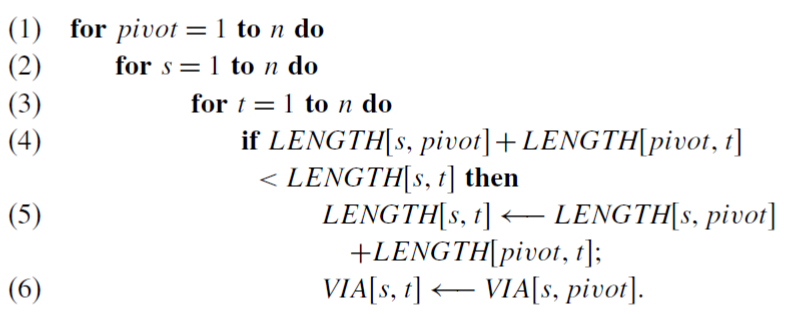
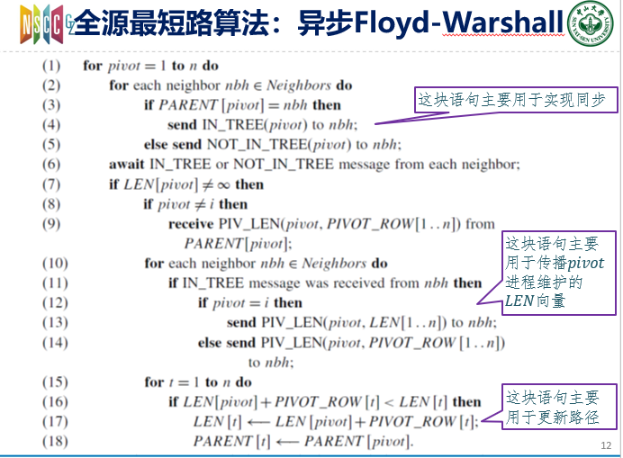

异步的Warshall算法找了半天没找到参考，自记一篇

<!-- more -->

## 同步算法

同步的**Floyd-Warshall**算法还是很简单的，算法过程如下

也很好理解，就是对于每条路径 (`s->t`)，寻找他们经过的最近的那个中间点（`pivot`），目标是找到一个`s->pivot->t`的路径比当前确定的`s->t`的路径还要近。所以就不停的测试，从`s`到`t`的路径变成`s->1->t`，`s->2->t`……会不会近一点……

更深入来说，其实是一种动态规划的思想，先找到任意两个节点通过节点1的最短长度，然后再找通过节点2的最短长度=min{using 1, 2}

可以去百度一下，同步算法的博客有很多，讲的比我详细的多，直接搜`floyd-warshall`就可以了

## 异步算法

异步算法就比较奇怪了，首先我们使用同步算法的依据是`LENGTH`这个变量保存了所有的距离信息，也就是说，全局的距离信息都是已知的，然而到了异步版本，每个进程都只知道自己到各个节点的距离（标记为`LEN`，而且这个最近的一跳也要记下来，标记为`PARENT`），而不知道其他两个节点的距离，所以我们需要处理，让每个进程知道全部的消息。

还是要按照同步算法的思想来处理，所以循环的最中心最重要的变量是`pivot`到各个节点的距离，所以我们可以将`pivot`节点的`LEN`信息对全网进行广播，所以其他节点就可以根据此个`pivot`的信息对自己的变量进行更新了。

草草的总结了一下，大致是这个意思的

* 依次用每个节点作为中心点pivot

  * 对于每个邻居节点nbh
    * 如果当前节点到pivot的最短路的下一跳是nbh，那么给nbh发送一个`intree(pivot)`
    * 如果不是，那给nbh发送一个`notintree(pivot)`

  ---

  * 等待每个邻居节点nbh的`intree`和`notintree`消息

  ---

  * 如果当前节点和`pivot`已经找到了路径，那么

    * 如果pivot不是自己，就从到pivot的下一跳节点请求`PIVOT_ROW`
    * 对每个nbh邻居节点
      * 如果收到了nbh的`INTREE`消息
        * 如果pivot是自己，给nbh发送自己的len
        * 如果不是，就发送自己存的`PIVOT_ROW`给nbh
    * 当前就知道了自己到pivot的距离，pivot到其他节点的距离，可以更新路径

### 解释

还是集中式的算法一样，用每个节点作为`pivot`进行考虑，程序开始时，所有节点都给自己的邻居节点发送`INTREE`和`NOTINTREE`消息，表明自己想要到达`pivot`节点，需要（或不需要）下一跳经过这个邻居节点。

然后每个节点都进入了`await`状态，直到收到各自的所有邻居节点发来的消息。

然后程序继续执行

如果`LEN[pivot]`不是无穷，也就是当前节点已经找到了和`pivot`相连的一条路径

> 如果没找到的话，那么说明当前节点和pivot不相连，也就没有更新路径的可能性了，在当前pivot阶段，程序可以结束了，等待下一次循环

继续进行判断，如果`pivot`是自己，那么自己的`LEN`就是`pivot_row`这个变量。如果不是呢，那么就要想办法获取这个变量（`pivot`节点到各个节点的最短距离），所以从离`pivot`更近的一个节点进行寻找，也就是说从`Parent[pivot]`进行寻找，等待它给我们发送一个`pivot_row`的信息。这里又要进入`await`状态了，没有这个消息我们确实寸步难行。

得到之后，我们遍历每个邻居节点nbh。如果收到了nbh的`intree`消息，那么说明我们当前节点是`nbh`到`pivot`节点的下一跳，也意味着我们要给它发送`pivot_row`消息（对照上一段），所以我们给他发`pivot_row`，同样，如果自己就是`pivot`，那就发自己的`len`就可以了，如果自己不是，那就发自己收到的`pivot_row`（上一段收到的）。

这样操作结束后，当前节点通知了所有其他需要通知的节点`PIVOT_ROW`消息，所以理论上来说，让所有节点都收到`pivot_row`消息的操作已经圆满了（至少分配给自己节点的任务已经完成了），可能需要等一等，就可以让所有节点知道合理的`pivot_row`了。

当然我们的当前节点没有必要等待，它可以直接进行下一步了，那就是更新自己的`LEN`变量（根据`pivot_row`和`len`，就相当于同步算法的`length[s, t]`和`length[pivot, ...]`）

这样，就可以让所有节点生成一棵全源最短路的图了。

### 总结

本质上来说，这个和集中式的算法没有区别，但是为了不同进程的同步，我们加入了很多处理同步的内容，需要耐心但不是特别难。